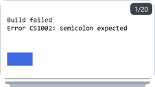
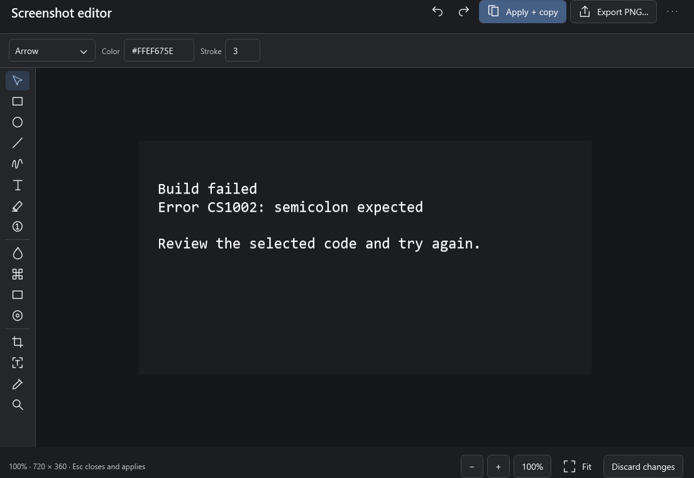
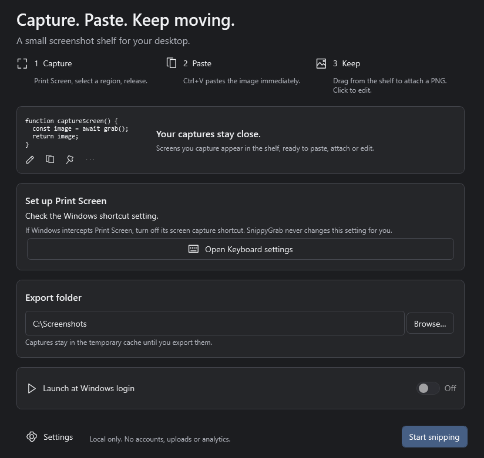
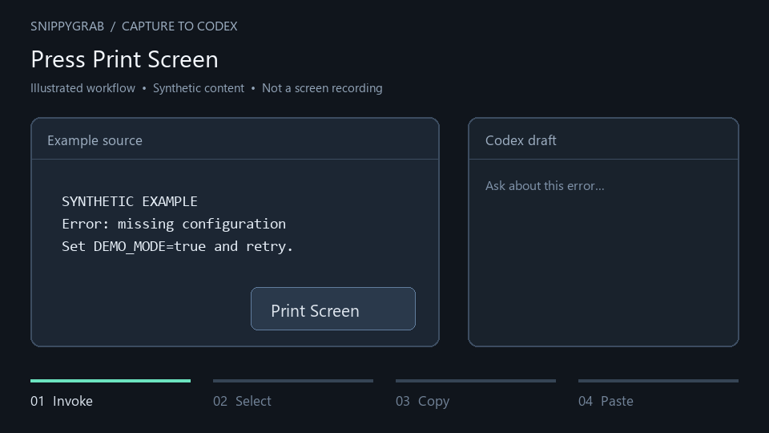

# SnippyGrab

A native Windows screenshot shelf for AI and developer workflows.

Current acceptance: **0 required gates open / 51 checked** after verified hosted publication and final reconciliation; see [the current acceptance record](docs/FINAL-FOUR-ACCEPTANCE-20261007.md). All required gates are closed within the recorded scope; the published build remains an unsigned prerelease.

**Print Screen → select → release → paste or drag.** Captures land on the clipboard and a small transparent shelf. Click to annotate, Ctrl-click several images to attach together, or copy terminal errors with local OCR.

.NET 10, WPF and Win32. No Electron, account, telemetry or cloud dependency.

**0.1.0 alpha:** runnable implementation with unit, integration and interactive synthetic checks. Receiver acceptance and available hardware scope are accepted by the owner; exact receiver versions and wider hardware coverage remain limitations. [Verification](docs/VALIDATION.md) · [Architecture](docs/ARCHITECTURE.md) · [Desktop acceptance](docs/ACCEPTANCE.md)

The [historical hosted review](docs/REMAINING-WORK.md) records GitHub checks/protection and the first alpha publication. [Current acceptance](docs/FINAL-FOUR-ACCEPTANCE-20261007.md) records completed acceptance and current startup/OCR measurements. All 51 queue entries are now closed within the recorded scope. Earlier reviews retain their own historical counts and verification boundaries.

[Acceptance queue](TASK_QUEUE.md) records implemented requirements, review findings and their closure evidence. [User testing checklist](docs/USER-TESTING.md) records accepted interaction behavior. The timing comparison and final hosted publication are complete within the current acceptance record.

## Preview

Synthetic content rendered by the actual WPF interface; no private captures.







Illustrated capture-to-Codex workflow, using synthetic content. This animation is a diagram, not a recording of an acceptance test.



## Installation

Windows 10 22H2 / Windows 11 **x64**; Windows 11 is the primary tested OS.

Extract the complete release ZIP, then run `SnippyGrab.exe`. Keep `Tesseract.dll`, `x64/` and `tessdata/` beside it. .NET is self-contained. OCR can additionally require the [Microsoft VC++ 2015–2022 x64 redistributable](https://learn.microsoft.com/en-us/cpp/windows/latest-supported-vc-redist); capture still works if OCR cannot load.

For per-user installation without elevation, run `powershell -NoProfile -File .\install.ps1` from the extracted bundle; add `-Startup` to enable login startup. Local script execution must be permitted by your PowerShell policy. The installer adds a Start menu shortcut and Apps uninstall entry. Exit from the tray before upgrading/uninstalling. Uninstall removes its startup registration and application files; captures/settings remain in `%LOCALAPPDATA%\SnippyGrab` for recovery. Portable removal: disable login startup, exit, then delete the extracted directory. Remove user data separately when no longer needed.

Initial builds are unsigned; SmartScreen may prompt. Compare `Get-FileHash <download.zip> -Algorithm SHA256` with the release `.sha256`. Bundles include `SHA256SUMS.txt`. Hashes verify integrity, not publisher identity. Published builds are available under [GitHub releases](https://github.com/How-e/SnippyGrab/releases); the latest validated prerelease is [0.1.0-alpha.acceptance.20261007.8](https://github.com/How-e/SnippyGrab/releases/tag/v0.1.0-alpha.acceptance.20261007.8). See [publication checks](docs/PUBLICATION.md) for verification scope.

## Usage

The app lives in the tray. Closing a window keeps it running; **Exit** stops it. Double-click the tray icon to capture. First run explains the Windows Print Screen prerequisite, opens Keyboard settings on request, and lets you choose a Pictures / PNG export folder and optional login startup. The export folder defaults to your Windows Pictures folder; Browse chooses another location. Captures remain in the temporary cache until explicitly exported.

- Capture and immediately **Ctrl+V** into an application accepting clipboard images.
- Drag a thumbnail to attach its temporary PNG file.
- **Ctrl-click** several captures, then drag one selected image to export all of them. Multi-image Ctrl+C copies file-drop data; no universal multi-image bitmap paste format exists.
- File-copy and drag use **ascending shelf-number order**, regardless of selection-click order. Alt-reordering changes that order. Cards grow outward from number 1 at the anchored corner, so physical left-to-right/top-to-bottom order can be reversed. History file transfers also use underlying shelf order, even if the history list is sorted by capture time. Receivers may present attachments in a different order.
- For dock keyboard use, click a numbered badge or choose **Focus screenshot shelf (keyboard)** in the tray. Arrows move focus in the displayed direction; Home/End reach the first/last capture; Space toggles selection. Copy/Delete act on selected captures, or the focused capture if none are selected. Enter, Ctrl+S and Ctrl+P edit/export/pin the focused capture. Ctrl+H opens history; Ctrl+, opens settings. Tab reaches card controls; Escape clears selection and collapses. Hover and a new capture do not acquire keyboard focus.
- Wheel to browse. Hover expands inward from the primary card at the chosen corner and reveals edit/copy/pin/save/OCR/dismiss. Leaving collapses after a brief delay while preserving selections; keyboard use and dragging keep it open. **Alt-drag** onto another shelf image to move to that image's numbered position, in either direction.
- Click to edit: crop, arrow, rectangle, ellipse, pen, line, text, highlighter, numbered marker, blur, pixelate, solid redaction and spotlight. Ctrl+wheel zooms. **Apply + copy** updates the managed shelf image and clipboard. **Export PNG…** (Ctrl+S) applies edits and opens a file dialog, without writing the clipboard. It starts in the configured directory on first export and remembers the previous destination for later exports; the dialog always confirms the filename/overwrite. Successful export shows the full path and enables **Open export folder**. Closing applies pending edits; **Discard** leaves pending edits unapplied.
- Captures are full-resolution lossless PNGs. Shelf/history/pin previews shrink images to fit. Settings → Screenshot shelf → **Preview quality** offers Balanced, Sharp (default), or Original; Original uses more memory. **Thumbnail width** changes the shelf size. Open the editor and choose **100%** to inspect detail. Preview settings do not reduce copy/export/OCR resolution.
- OCR runs locally in English. Settings → Text recognition offers small-text enhancement and Auto, SparseText (dialogs/mixed screenshots), or SingleBlock (one paragraph) layout. Auto can retry scattered text when confidence is low. Choose **OCR selected area** in the editor to isolate a message from surrounding windows/backgrounds. Review extracted text for character errors; enlarging cannot reconstruct missing detail in an already blurry source.
- Pin indefinitely. Detach through the context menu for a resizable desktop pin; restore click-through interaction from the tray.
- Recent captures recovers hidden items; import accepts PNG/JPEG/BMP with size limits.

## Default shortcuts

| Shortcut | Action |
|---|---|
| Print Screen | Region |
| Ctrl+Print Screen | Entire virtual desktop |
| Alt+Print Screen | Active window |
| Ctrl+Alt+Print Screen | Window picker |
| Ctrl+Shift+S | Fallback region |
| Esc during selection | Cancel |
| Ctrl+C / Ctrl+S on shelf | Copy / Save as |
| Enter / Delete on shelf | Edit / Dismiss |
| Ctrl+Z / Ctrl+Y in editor | Undo / Redo |
| Esc in editor | Close and apply |

Configure global shortcuts in Settings; Escape in a hotkey field disables that shortcut. If Windows intercepts Print Screen, disable **Settings → Accessibility → Keyboard → Use the Print Screen key to open screen capture**, then restart. Conflicts are reported; Windows settings are never changed automatically. Hotkeys pause while configuring settings.

## Settings and cache

Settings cover capture/cursor/hotkeys, monitor/corner/orientation/sizing, opacity/topmost/collapse/hide/lifetime, clipboard image + PNG, retention/history, annotation defaults, startup and theme.

Cache: `%LOCALAPPDATA%\SnippyGrab\cache`. Captures are not dumped into Pictures. Retention supports 1/24/168 hours or `-1` for never. Pins survive cleanup. Editors/drags acquire leases; transfers and clipboard-file copies protect sources for **24 hours** after use. Clear/session-only cleanup respects that grace. Receivers must copy before it ends. Saved exports must be outside the cache. Custom cache paths apply on restart; old captures stay in the old cache.

Optional history stores time, dimensions, capture origin, pin/edit/save state and the last successful export path, not titles/processes or OCR text. Disabling history preserves pins. Unreadable history blocks cleanup and uses a recovery sidecar so new pins and transfers survive restart. Unknown old captures are conservatively pinned, even with history disabled. Open Recent captures to confirm recovered history; the unreadable original is archived before cleanup resumes. Review unknown captures before unpinning them. If recovery exceeds the metadata size limit or storage remains unwritable, cleanup stays blocked. Cache files are local plaintext, not an encrypted vault.

## Privacy

No uploads, accounts, advertising, analytics, update polling, local server or runtime network requests. Build-time package/model downloads need network. English OCR is bundled; other languages are not configured in the initial UI. Logs contain timings/error categories, never pixels, OCR text or titles.

Windows clipboard history/sync and receiving applications have their own policies. Redaction cannot retract previous copies or erase previous cached revisions. Protected/DRM/secure-desktop content may be blank. [Threat model](docs/THREAT-MODEL.md) · [Security](SECURITY.md)

## Build and verify

Pinned .NET SDK 10.0.400 on Windows:

Source builds also require installed Visual Studio 2022 C++ x64 tools, Windows SDK, CMake, Git and PowerShell 7. The first build provisions the pinned native OCR sources and compiles them; later builds use the verified cache. Portable/installed users require no compiler. See [native OCR build](docs/NATIVE-OCR.md).

```powershell
pwsh ./scripts/provision-ocr.ps1
dotnet restore --locked-mode
dotnet build -c Release -warnaserror
dotnet test -c Release
dotnet format --no-restore --verify-no-changes
dotnet run --project src/SnippyGrab.App
```

OCR provisioning pins model commit and SHA-256; NuGet versions/hashes are locked. Downloaded binaries/models and personal runtime data are excluded from Git.

`pwsh ./scripts/package.ps1 -Version 0.1.0-alpha` creates the executable, dependencies, installer script, notices and checksums.

On an idle interactive desktop, run the executable with `--self-test C:/absolute/checks.json` or `--benchmark C:/absolute/benchmarks.json`. These temporarily show synthetic windows and move the pointer; ordinary tests need no interactive desktop.

CI builds/tests, verifies formatting and audits dependencies. CodeQL runs separately. The configured GitHub repository protects main and version tags. Tag workflows build and publish ZIP/setup + SHA-256; the initial upload required manual recovery and its correction is merged. [Release guide](docs/RELEASING.md)

## Known limitations

- Alpha: the owner reported successful Codex/ChatGPT/VS Code/browser drop and paste. Exact-version, selection/order and delayed-read acceptance remains incomplete; receiver support varies.
- GDI produces SDR; HDR colors can differ. Window capture uses visible pixels, without reconstructing occluded/minimized/protected windows.
- Physical selections passed at 100% and 150% on the connected mixed-DPI layout. Owner acceptance covers the available layout and current accessibility configuration. 125/175/200%, vertical/HDR screens and other text-scale/assistive-technology configurations remain unverified compatibility limits; the owner accepted this narrower scope. Explorer restart, sleep/resume and all-day behavior remain unverified.
- A short fresh-process sample measured about 128 MB tray working set. The [two-hour synthetic resource test](docs/RESOURCE-REVIEW-20261007.md) passes; all-day use and startup latency need more benchmarking; .NET packaging is larger than a C++ utility. The user-run [two-hour resource test instructions](docs/RESOURCE-TESTING.md) provide the packaged command and reporting criteria.
- Undo is bounded to 20 states; large crop/effect histories can consume substantial memory. Annotation counts and imported sizes are bounded.
- Transfers protect sources for 24 hours. Session-only cleans on normal exit while preserving pins/transfers; crashes fall back to retention.
- User-profile ACLs protect normal cache access. Files are not encrypted or securely erased.

## Contributing

[CONTRIBUTING.md](CONTRIBUTING.md) covers checks and privacy-safe evidence. MIT licensed; OCR licenses are under `licenses/`. Recording, cloud sharing and accounts are out of scope.

### Print Screen setup and conflicts

Windows Settings → Accessibility → Keyboard → **Use the Print Screen key to open screen capture** must be off when Windows intercepts Print Screen. Restart SnippyGrab afterward; the app never changes this preference. The default region fallback is **Ctrl+Shift+S**, configurable in Settings. If another app owns that combination, choose a different fallback. Tray → Capture region works even when every hotkey is unavailable. Tray → Hotkey help / conflicts shows the complete guidance if a notification is truncated. Setup and Settings temporarily suspend hotkeys and preserve your paused state on close. Held keys do not repeat captures.

### Retention and transfer grace

Retention accepts 1 hour, 24 hours, 7 days or never. Explicit Clear removes all eligible unpinned captures; Session-only exit removes only files created or revised by that process, including superseded revisions. Prior-session captures follow normal retention. Pins and open editor/pin/drag leases always prevent deletion. File clipboard and native drag sources keep a durable 24-hour grace from transfer start, extended to 24 hours after transfer release; delayed receivers must read within that limit. This grace intentionally takes precedence over Clear and session-only exit. An abnormal exit preserves files until a subsequent cleanup; ordinary retention and persisted transfer grace apply on restart. Only owned stale staging files and unused metadata pages older than 24 hours are cleaned. Explicit history restoration restarts storage age without altering historical capture time.

Edits have one active editor per capture: Edit focuses that editor. Managed revision commits refresh the dock, detached pin and open history preview. Apply + copy (including editor close) copies the committed image; Export PNG deliberately leaves the clipboard unchanged. An already-issued file transfer still references its immutable old revision during its grace period. A stale editor revision cannot overwrite newer committed pixels.

Recent captures refreshes while open and shows 200 entries per page. Dismiss only hides from the shelf; Clear temporary deletes eligible unpinned files. With history disabled, unpinned metadata is not remembered across launches; pins and transfer protection remain persistent. New captures record the Windows display device labels intersecting the capture bounds, including multiple displays. These are topology labels rather than permanent hardware identities; no process names, window titles or OCR text are recorded. Detached pins support resize, topmost, opacity, click-through and tray recovery; per-monitor DPI/gesture acceptance remains pending.
### Capture, display and editor contracts

When Include cursor is enabled, the cursor is sampled when the desktop/window snapshot is taken. Region and window-picker captures keep that frozen cursor position; moving the pointer to select a region does not stamp a second cursor at release. The cursor hotspot and crop offsets use physical pixels, with clipping at image edges. Cursor inclusion is off by default.

Capture uses an 8-bit GDI bitmap and exports PNG. HDR tone mapping/color fidelity is not verified or preserved as HDR; use this as SDR output. Protected/occluded content and gaps between monitors remain Windows capture limitations.

Shelf positions include four corners and centered Top, Bottom, Left and Right edges. Edge shelves expand inward automatically; corner orientation remains configurable. Existing corner values migrate unchanged. Explicit monitor choices are saved by Windows monitor device identity; a disconnected selected monitor falls back to the primary display and its saved identity is retained for reconnect. Driver changes or moving a monitor to a different connection may change the identity, requiring selection again. A display change keeps a hidden shelf hidden.

Editor crop/effect/flattening/PNG work runs on workers with frozen image inputs. Undo retains up to 20 states and approximately 256 MiB of distinct decoded images and stroke data; large image operations may evict old undo steps. One required current image can exceed this budget under the 80-megapixel input limit, and rendering/encoding has additional transient memory. Blur/pixelation are visual effects; use Solid redaction for opaque removal from a newly flattened image. Earlier clipboard, export and transferred revisions are not retracted.

The English OCR model is checked at runtime against its pinned SHA-256. Missing/modified models and native loader failures leave capture available. OCR can confuse similar glyphs such as zero and `@`; review copied error codes. No model is downloaded at runtime. See [dependency review](docs/DEPENDENCY-REVIEW.md) for the source-pinned native upgrade, reviewed advisory fixes and residual risks.

Settings retention uses named 1-hour/24-hour/7-day/never choices and preserves saved custom durations. Animation fades new shelf arrivals only; it respects Windows motion/high-contrast preferences. Reset creates a draft of defaults; Cancel leaves saved settings unchanged. Updates remain manual/offline.


An unsigned self-contained SnippyGrab-<version>-Setup.exe installer is generated alongside the portable ZIP. It verifies embedded payload hashes, installs for the current user, and makes login startup opt-in. Its packaged PowerShell installation runs with a process-local execution-policy override; organization policy can still block it. No system preference/policy is changed. SmartScreen and offline Visual C++ OCR prerequisites still apply.


Editor inspection tools: select **Magnify** and click the image to double zoom around that point; Shift-click halves zoom. Existing Fit/100% and Ctrl+wheel remain available. **Pick image color** samples one pixel from the flattened current edits into the annotation HEX field, including crop/effect/redaction results. It leaves the document/undo history unchanged and performs no continuous background sampling.

Detached pins remember monitor-relative position, size, opacity, topmost and click-through in local capture metadata. Reopen a pin from history after restarting to use that layout; startup does not automatically open windows. Missing monitors fall back to the primary work area with clamped bounds. Adjust opacity continuously in the pin context menu. Tray → Restore pins disables click-through for open windows and saves that recovery state. Layout writes are debounced and a failed write retains the previous stored layout; private window layout metadata never leaves the machine.
